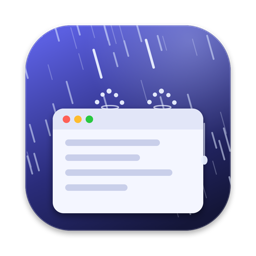
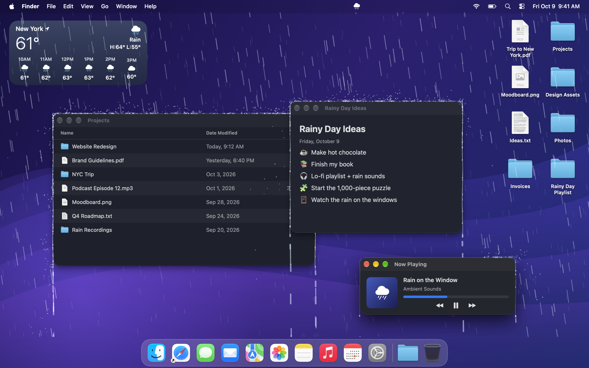
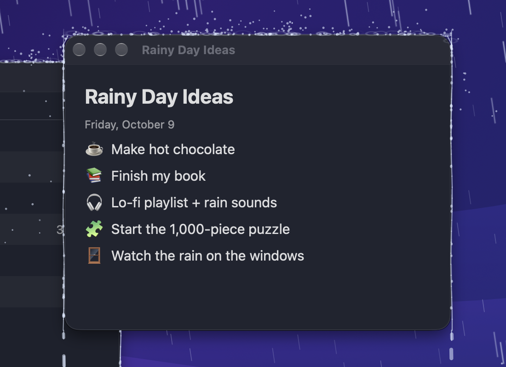
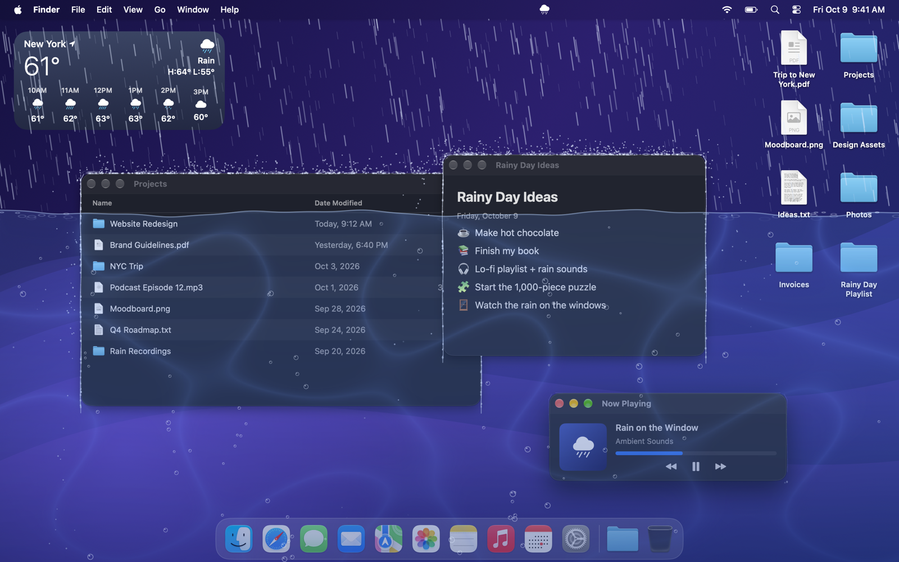
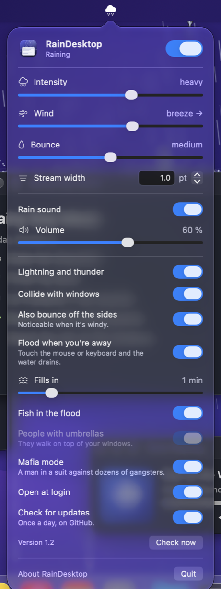

<p align="center">
  
</p>

<h1 align="center">RainDesktop</h1>

<p align="center">
  Rain behind your windows on macOS. Drops bounce off title bars, water runs down the sides,<br>
  and if you leave your Mac alone for a while, it slowly floods.
</p>

<p align="center">
  <a href="https://github.com/gonzaroman/RainDesktop/releases/latest"><b>Download</b></a> ·
  macOS 14 Sonoma or later · Apple silicon &amp; Intel · English / Español
</p>



## Features

- **Rain behind your windows.** It falls on your wallpaper and never covers what you're working on.
- **Real bounces.** Drops split into droplets that bounce off title bars and rounded corners. With wind,
  they also hit the sides.
- **Water that flows.** Water collects on top of each window, runs to the edges, trickles down the sides
  and keeps dripping below.
- **Flood mode.** Leave your Mac alone and the water rises, with waves, light caustics and bubbles. Touch
  the mouse or keyboard and it drains in a second.
- **Rain sound.** Synthesized in real time (no audio files), it follows the intensity and adds thunder after
  each flash of lightning. It mutes itself while another app is using the microphone, for example during a call.
- **Control panel** in the menu bar: intensity from drizzle to downpour, wind in both directions, bounce,
  stream width, volume and more. Right-click the icon to start or stop the rain.
- **Update notices.** A dot on the menu bar icon tells you when a new version is out; one click takes
  you to the download.
- **Light on resources.** Rendered with Metal; the physics runs at 60 fps and drops to 30 fps in Low Power Mode.

| Water running down the sides | Flood mode |
| --- | --- |
|  |  |

<p align="center">
  
</p>

## Privacy

RainDesktop asks for **no permissions**, and its only network connection is the update check.

- It only reads the **outline** of each window (position, size and stacking order), which macOS shares with
  every app. It never reads window titles, app names or anything on screen, so it doesn't need Screen Recording.
- To know whether you're away (for flood mode), it asks macOS how many seconds have passed since the last
  input. It never sees what you type, so it doesn't need Input Monitoring.
- To mute the sound during calls, it asks Core Audio whether another app is using the microphone. It never
  opens the microphone itself.
- Once a day it asks GitHub's public API for the latest version, to tell you when there's a new one. That
  request carries nothing about you, and you can turn it off in the panel (*Check for updates*).
- It runs in Apple's App Sandbox, with outgoing connections as its only extra entitlement.

## Install

1. Download `RainDesktop-1.1.zip` from the [latest release](https://github.com/gonzaroman/RainDesktop/releases/latest) and open it.
2. Drag **RainDesktop.app** to your **Applications** folder.
3. Open it. macOS will say it can't check the app for malicious software, because it isn't notarized by
   Apple. Click **Done** (not *Move to Trash*).
4. Go to **System Settings → Privacy & Security**, scroll down to the RainDesktop message and click
   **Open Anyway**. Confirm with your password or Touch ID.
5. A cloud appears in the menu bar. Click it to open the control panel.

You only have to do this once. Alternatively, run
`xattr -dr com.apple.quarantine /Applications/RainDesktop.app` in Terminal before opening it.

## Build from source

You need the Xcode Command Line Tools (`xcode-select --install`).

```sh
git clone https://github.com/gonzaroman/RainDesktop.git
cd RainDesktop
./build.sh            # builds a universal app, signs it and installs it in ~/Applications
./build.sh --release  # packages releases/RainDesktop-<version>.zip
```

An app built on your own Mac opens without any Gatekeeper warning.

## How it works

- `WindowTracker` polls `CGWindowListCopyWindowInfo` 10 times per second (60 while something moves) and keeps
  only the geometry of each window, ordered from front to back.
- `RainSimulation` moves every drop, droplet, bead and stream in points per second, so it behaves the same at
  any frame rate.
- `RainRenderer` draws everything in one instanced Metal draw call. Each shape knows which windows are in front
  of it, and the shader hides the parts covered by them, so rain can land on one window and disappear behind
  another.
- `Tools/Studio` builds a fictional desktop to take the screenshots in this README without showing anyone's files.

## Español

**RainDesktop** pone lluvia detrás de tus ventanas en macOS: las gotas rebotan en las barras de título, el
agua baja por los laterales y, si dejas el Mac un rato sin tocar, se va inundando. La app está en español
e inglés (sale en el idioma de tu Mac) y no pide ningún permiso. Su única conexión es una consulta diaria a
GitHub para avisarte de versiones nuevas, que no envía nada tuyo y se puede desactivar.

**Instalación:** descarga `RainDesktop-1.1.zip` de la [última versión](https://github.com/gonzaroman/RainDesktop/releases/latest), arrastra la
app a **Aplicaciones** y ábrela. Como no está notarizada por Apple, macOS mostrará un aviso: pulsa
**Aceptar**, ve a **Ajustes del Sistema → Privacidad y seguridad** y pulsa **Abrir igualmente**. Solo hay que
hacerlo la primera vez.

## License

[MIT](LICENSE) © 2026 Gonzalo Román
